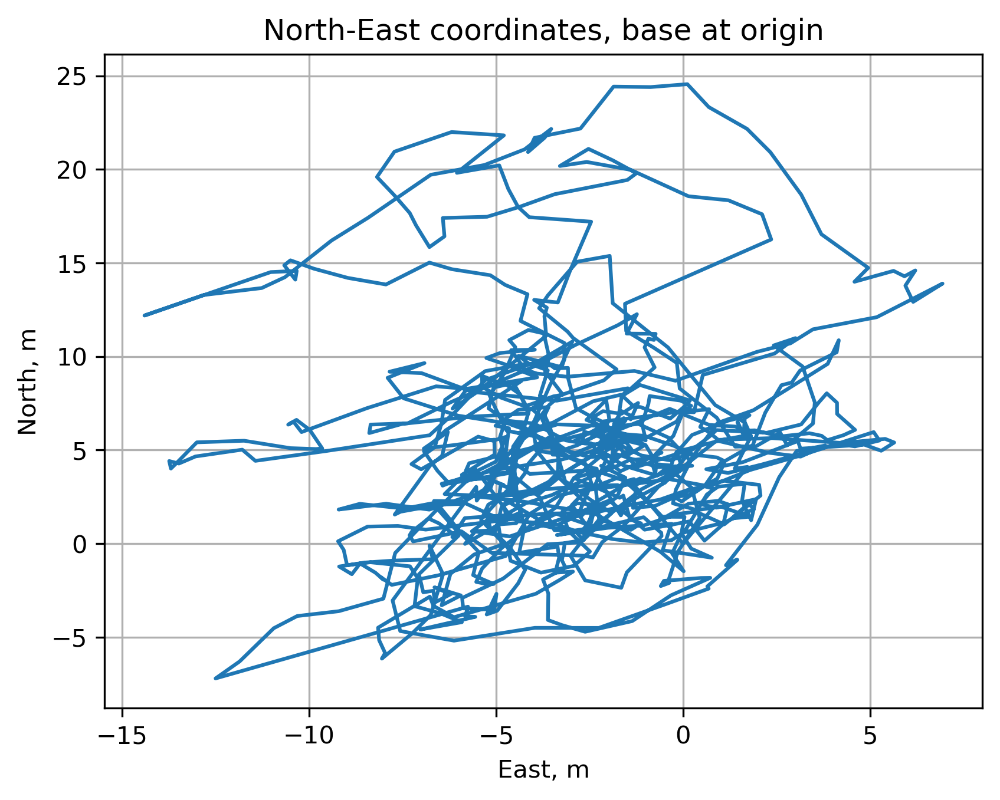
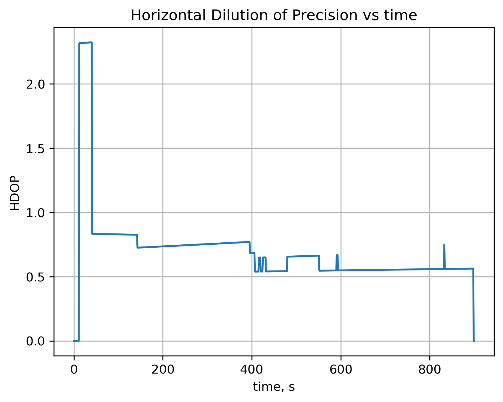

## Overview
This project implements a double-differenced code phase psuedoranging GNSS processing algorithm. The project assumes access to RINEX files and other GNSS data formats, and implements algorithms for position estimation, error analysis, and visualization. The data consists of real world recorded GNSS measurements from base and rover receivers.

## Results
This result was validated against the GPS receiver's actual estimated position, validating that the GNSS processing algorithm successfully calculated positions from the raw space vehicle (SV) measurements:

