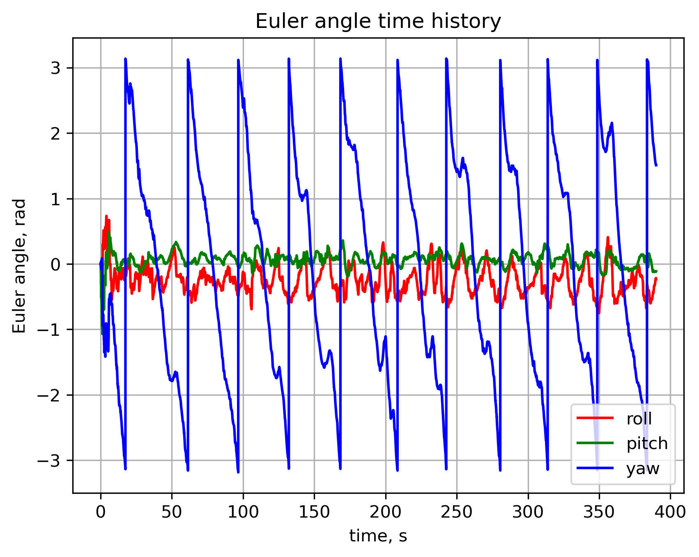
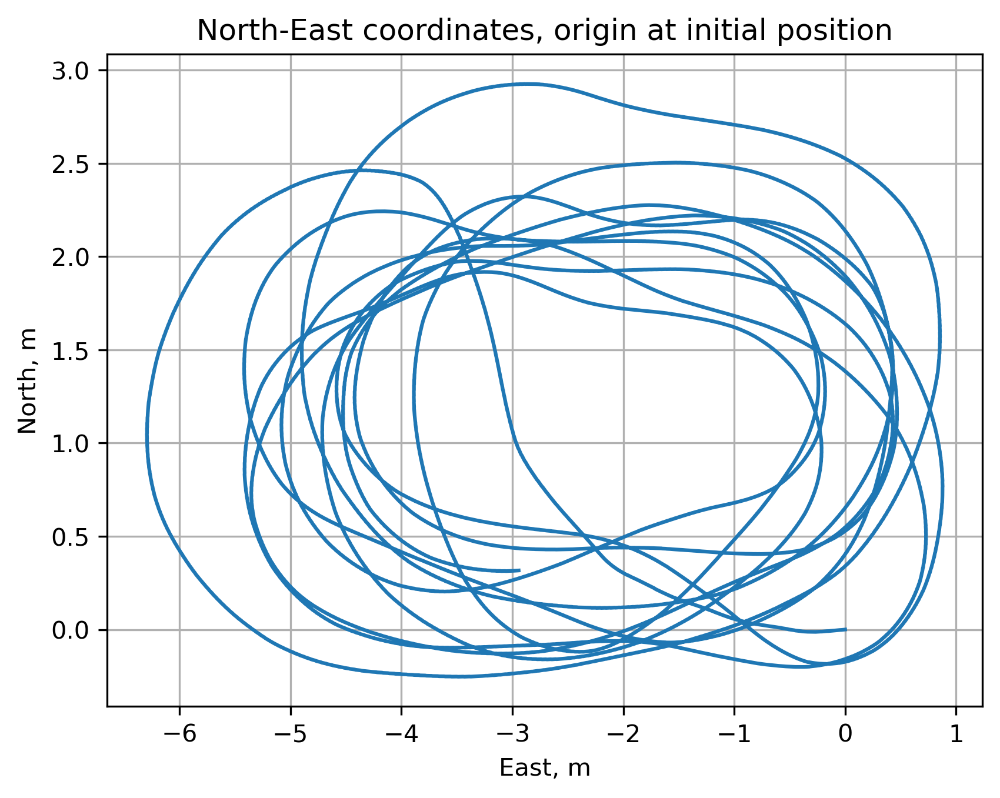
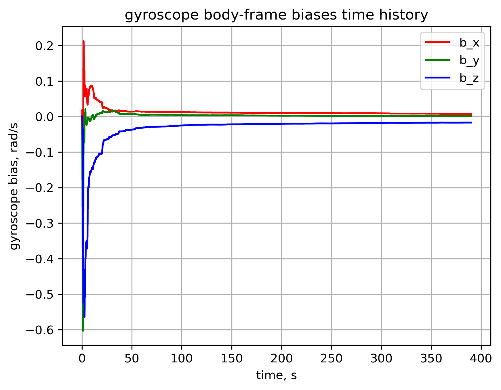

## Overview
This project integrates GNSS and Inertial Measurement Unit (IMU) data to create a loosely coupled Inertial Navigation System (INS). The integration leverages the strengths of both systems: GNSS provides absolute position updates, while IMU offers high-rate relative motion information. The project uses an error state EKF acting on the rotation matrices to handle the highly nonlinear attitude propogation equations and constraints (although my work for the Navy has extended this greatly, with both AHRS and INS mechanizations implemented with both factor graphs and ES-EKFs using quaternion formulations). The project assumes synchronized GNSS and IMU data are available, and implements sensor fusion algorithms to estimate position, velocity, and attitude. The data consists of real GNSS and IMU measurements recorded from a drone flight. The main goal is to demonstrate improved navigation performance through sensor fusion.

## Results

