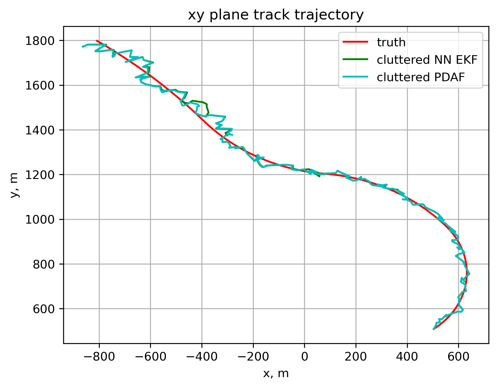

## Overview
This project implements the Probabilistic Data Association Filter (PDAF) and Extended Kalman Filter (EKF) with measurement gating for single-target tracking in cluttered environments. The project assumes a single target, and that the measurement noise and clutter statistics are provided. The inner EKF for the target tracking filters assume a coordinated, constant-rate turn motion model, which was also used to generate the simulated data (but with varying turn rates). Both filters are implemented with ellipsoidal gating to handle missed detections and clutter.

## Results
The most relevant result is the estimated and true xy position trajectory, showing the filter's ability to track the target in the presence of clutter:

### Commentary
The PDAF and EKF, both implemented using ellipsoidal gating on the measurements, perform remarkably similarly. This makes sense, as the only difference between the two is the data association method: nearest neighbor vs all neighbor probabilistic. The PDAF method also weights the nearest neighbor measurement the largest, and hence the output is very similar to an EKF with nearest neighbor. 

The only noticable differences occur when there are multiple measurements very close to the predicted target state. In these cases, the PDAF includes all of these measurements in its update, while the NN EKF chooses one to solely use. A small difference in performance can be seen in multiple locations on the plots where this happens, but the two solutions re-converge once there is only one measurement within the ellipsoidal gate. 

The conclusion here is that the PDAF and NN-EKF, if both implement ellipsoidal gating to avoid divergence due to missed detections, perform very similarly owing to them having only one conceptual difference in their methods. In this case, the PDAF may be a better choice if the sensor data contains much clutter, as it weights all measurements probabilistically and does not 'over-commit' to one measurement like the NN-EKF. However, the difference as seen in this example is marginal. If the EKF does not implement ellipsoidal gating, however, the filter diverges with missed detections. In this case, the PDAF is clearly a superior choice as it does gate the data and does not diverge. 
