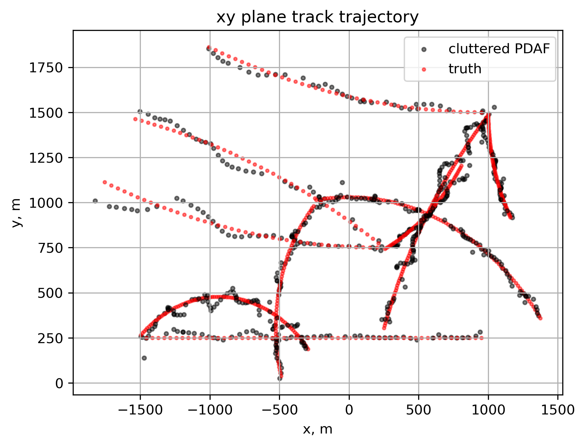

### Commentary
The GM-PHD is a very strong multi-target tracker in the presence of clutter missed detections, especially compared to non-RFS methods such as JPDAF. This is because the GM-PHD is, firstly, not required to have knowledge about the number of targets being tracked, and thus can flexibly approximate whatever the (possibly changing) number of targets is without the need for ad-hoc methods to estimate the number of targets like JPDAF. Secondly, the GM-PHD tracks multiple hypotheses throughout time, allowing for uncertainty in measurement-data association. This is a very powerful trait, as this allows the filter to later determine which measurement association was most likely correct, thereby increasing accuracy of the filter by reducing the probability for faulty data associations. The multiple Gaussian elements in the mixture essentially allow the filter to do this; the very large number of very low-weighted Gaussian elements show the filter tracking all these hypotheses, many of which are very low-probability. Finally, the filter is also powerful because it runs a kalman-type filter at its core, which is widely studied and has many different types applicable to many applications. 

The strength of the GM-PHD comes with a cost, however. While the memory requirements are low since the filter only carries the terms w, m, and P of each gaussian element, the computational cost of evaluating every measurement against every gaussian element is very large. This can be seen when running this code, as the filter takes much longer to run than the PDAF code written for P4. 

With that said, in the presence of multiple targets, clutter, and missed detections, the GM-PHD is a very strong filter choice (if compute available allows it for the application) as it improves the data association solution from the JPDAF or GNN filters by allowing multiple hypotheses. 

---

## Overview
This project implements the Gaussian Mixture Probability Hypothesis Density (GM-PHD) filter for multi-target tracking in cluttered environments. The GM-PHD filter is a Random Finite Set (RFS) based approach that does not require prior knowledge of the number of targets and can handle target birth, death, and missed detections. The project assumes that measurement noise, clutter statistics, target birth and death models, and sensor models are given/known. The motion model used in the GM-PHD's inner EKF is a coordinated, constant-turn rate model, which was also used (with varying turn rate) to generate the simulated data. The data consists of simulated ground truth trajectories and noisy, cluttered sensor measurements. 

## Results
The most relevant result is the estimated and true xy position trajectory, showing the filter's ability to track multiple targets and reject clutter:

